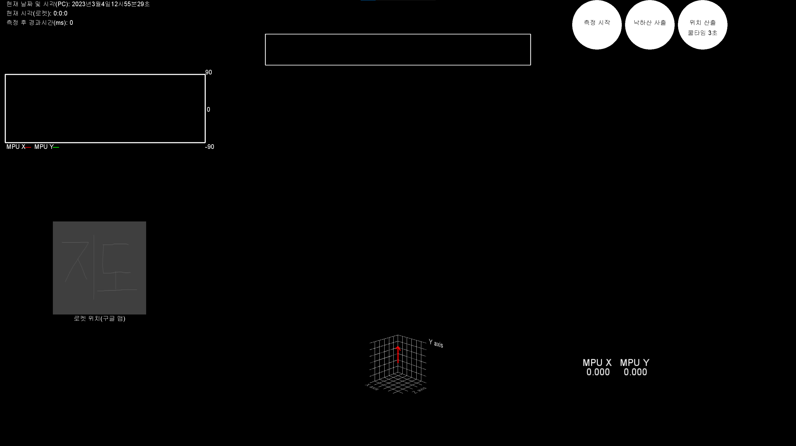

# Rocket_Software
 - Arduino software for being embedded in a rocket
 - Ground software with Processing for checking and analyzing status of the rocket.
 
  
 
 ## Features
 - Real time visualization of inclination of a rocket (X axis, Y axis) with 3D graph and 3D rocket model.
 - Graph for checking numeric degree of inclination
 - Checking the time of a computer executing GS and from rockets.
 - Showing location of the rocket using Google Map API.
 - Showing messages from a Arduino board.
 
  
 
 ## A Screenshot of Ground software

